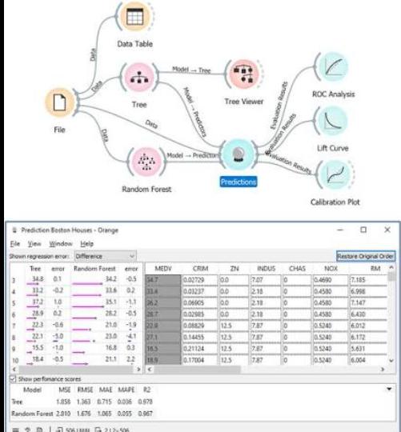
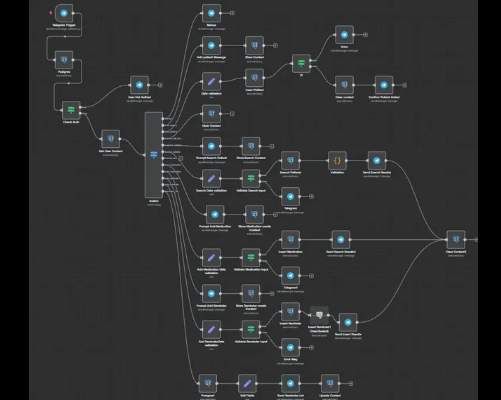

Foto fácil

# Sobre o projeto
O A ideia do projeto Foto fácil é criar um editor de imagens baseado em nós, fortemente inspirado em sistemas como Orange Datamining (focado em uso de IA e redes neurais) e o n8n, a ideia do projeto é permitir que o usuário edite imagens (seja uma imagem de cada vez ou várias de uma vez) com um fluxo profissional e diferente de editores de imagem convencionais (como Photoshop), com nós de edição básica de imagens (como recorte, transformação, filtros) e um braço forte de nós relacionados a processamento digital de imagem (nós de geração de histograma, estatística, etc.), e nós de fluxo (loop, condição, etc.) a ideia é permitir tanto usuários mais leigos que só querem uma edição rápida (ex: adicionar a marca d'água em 300 imagens apenas apontando a pasta das imagens sem a marca d'água) até o uso de academicos (processar 2000 imagens de um dataser para deixar em níveis de cinza para processar com IA). O projeto tem foco em conseguir uma interface intuitiva de nós, um design agradavél e funções eficientes com golang

# Inpirações visuais

Orange datamining

N8N

# Requisitos
- Grande parte do projeto se baseia em DAG
- O projeto deve ter um sistema de "abas" semelhante ao excel, onde o usuário cria diversos fluxos, cada fluxo em uma aba (as abas/fluxos e os nodes devem poder ser renomeados pelo usuário somente para gerenciamento pessoal)
- Cada nó deve ter, no mínimo, um tipo, um nome (editável), os parâmetros/atributos (se for necessário) e conseguir consumir as saídas de nós anteriores para fazer seu processamento
- deve ser possível exportar e importar fluxos na forma de JSON a qualquer momento, incluindo nodes/nós e suas configurações
- ele deve se focar nas cores preto e roxo no modo escuro e branco e roxo no modo claro (que deve ser funcional)
- todos os nós que convém devem conseguir consumir uma imagem ou várias dependendo do que está na saída de nós anteriores
- para fluxos, por exemplo, com o nó de rotate que recebe várias imagens, coloque uma imagem de exemplo e deixe o usuário relecionar um input de graus de rotação, esse mesmo valor de rotação será aplicado para todas as imagens, um grande desafio vai ser fazer esses nós funcionarem com várias imagens, pense sobre isso
- O backend do projeto deve se aproveitar da facilidade do Golang de gerenciar projetos assincronos, a linguagem tem uma versão do openCV e deve usa-la em conjunto com outras ferramentas para deixar o processamento rápido e eficiente, e claro o usuário deve se aproveitar dessa assincronicidade para podere fazer outras coisas enquanto o fluxo é executado
- O projeto deve ser uma aplicação desktop, usando algo como Electron para o front (vc é livre para escolher qual ferramenta/linguagem usar no front), e golang para o backend

## Nós (no é relevante dividi-los em categorias conforme o relevante)
- Image input: Inserir imagem
- Image output: Exibir o resultado final ou intermediário do fluxo
- Directory Batch: Para acessar/processar multiplas imagens de uma pasta
- Download: Para baixar uma ou multiplas imagens resultadas de um fluxo
- Color Space: Passa imagem para Escala de Cinza, HSV, Lab, YCbCr, ou RGB
- Brightness & Contrast: Ajustes lineares simples
- Threshholdin: Global ou adaptativo
- Crop/resize: Cortar e redimensionar
- Rotate/flip: Rotacionar e espelhar
- Blur / Smoothing: Filtro Gaussiano, Filtro de Média e Mediana (remoção de ruído)
- Noise: Nó de geração de ruído para testes (gaussiano, salt and pepper, speckle)
- Edge Detection: Sobel, Laplacian e Canny (os pilares do PDI acadêmico)
- Morphological Operations: Erosão e Dilatação (essenciais para análise de formas)
- Histogram: Nó que gera um gráfico de histograma (distribuição por cores)
- Statistics: Exibir métricas da imagem (Média, Mediana, Desvio Padrão de pixel, PSNR, MSE)
- Matriz/Array: Permitir que o usuário veja a imagem como ela realmente é para o computador: uma matriz de números (ex: exibir um grid com os valores de 0 a 255 de uma região selecionada)
- Nó de Domínio da Frequência (FFT): Transformada Rápida de Fourier. Mostrar o espectro de magnitude e fase da imagem e permitir filtros na frequência (Passa-Alta, Passa-Baixa). Isso é o terror e o amor de todo estudante de PDI
- Custom node: Permitir ao usuário criar um script em golang ou python para consumir as saídas de nós anteriores e fazer o processamento que quiser (de preferencia que venha já com uma estrutura básica de código importanto opencv/numpy), o nó deve cuspir o output do código
- IA/Machine Learning: Integração com modelos ONNX ou TFLite para nós de remoção de fundo, super-resolução e afins.
- Comparação Visual: Nó que recebe duas imagens e exibe um slider interativo (before/after) para comparação direta na interface.

# Boas práticas
- códigos e comentários devem ser feitos em inglês, já os documentos a serem criados dentro desse architecture-docs devem ser em pt-br
- é restritamente necessário usar TDD para desenvolver TODAS as features mencionadas
- é restritamente necessário se preocupar com segurança da informação, usando boas práticas como .env, e outras mecânicas de código
- Esse repositório está atrelado a um github, caso seja necessário (quando for solicitado), faça commits curtos, descritivos, usando as boas práticas de nomeação de commits em inglês
- De atenção a possiveis problemas de paralelismo e concorrência que podem ocorrer
- o sistema deve evitar ao máximo cores hardcoded (e outros elementos hardcoded), usando um sistema de temas ou o que for possível com a ferramenta escolhido
- Para QUALQUER edição feita por você, crie o log da edição em um arquivo logs.md dentro da pasta architecture-docs, ele será seu mapa para saber se algo já foi feito ou não (provavelmente somente modelos de IA de auxilio a programação irão ler, então faça direto e não precisa se focar tanto em deixar o documento bonito)
- documentos relacionados a arquitetura e pedidos meus a você devem ser criados nessa parta architecture-docs, enquanto o código em sí será feito na raiz do projeto